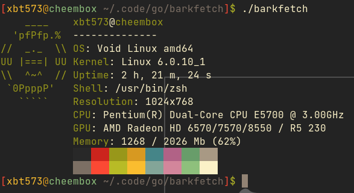

# barkfetch
Barkfetch is an [neofetch](https://github.com/dylanaraps/neofetch)-like utility, written in Go. Currently in very alpha.



# How to build
0. Make sure you have go compiler installed in your system
1. Clone repo and cd into it
```bash
$ git clone https://github.com/xbt573/barkfetch && cd barkfetch
```

2. Build with Go
```bash
$ go build
```

3. Install binary and config
```bash
$ go install

$ mkdir ~/.config/barkfetch
$ cp barkfetch.config ~/.config/barkfetch/config
```